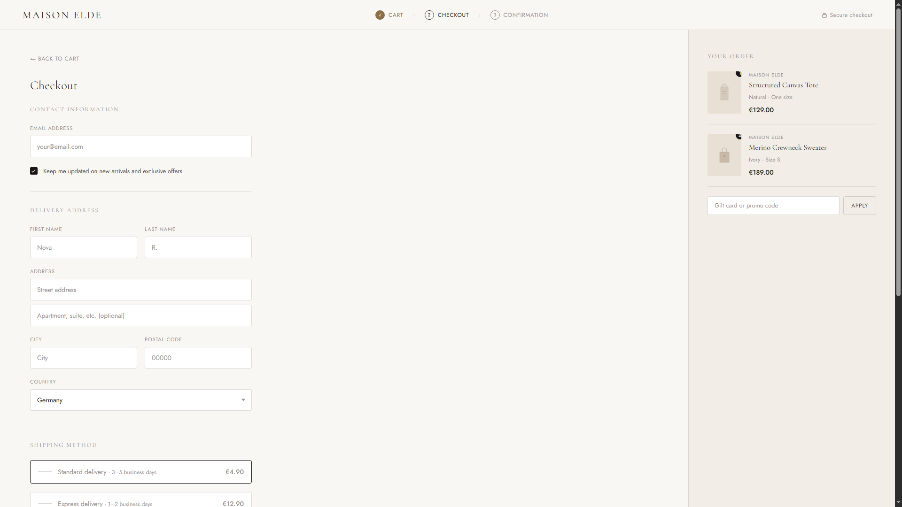

# Maison Elde — Checkout Flow

A premium fashion e-commerce checkout and order confirmation flow built for Maison Elde, a fictional apparel brand. Demonstrates the full transactional UI experience — from cart to confirmed order — with a refined, warm aesthetic designed for high-end retail.

**Live demo → [rinlabsx.github.io/maison-elde-checkout](https://rinlabsx.github.io/maison-elde-checkout)**

---

## What's included

- Three-step progress indicator (Cart → Checkout → Confirmation)
- Contact information and delivery address form
- Shipping method selector with three tiers
- Payment form with card input and saved card option
- Order summary sidebar with itemized totals, discount badge, and promo code field
- Animated order confirmation screen with order number, estimated delivery, and status timeline
- Full transition from checkout to confirmation state with a single click

## Tech stack

- Vanilla HTML, CSS, JavaScript — no framework, no dependencies
- Single-file architecture, opens directly in any modern browser
- Fully responsive layout for mobile and desktop

## Design direction

Warm cream palette with tobacco accents. Cormorant serif for display text, Jost for UI. Refined, editorial, and intentionally distinct from technical dashboards — built to show range across different client types and brand aesthetics.

## Why this exists

This is a portfolio piece demonstrating customer-facing transactional UI — checkout flow architecture, form design, state transitions, and premium brand execution. The kind of work an apparel brand or e-commerce studio would commission to lift conversion and brand perception simultaneously.

Built by [Nova R.](https://www.upwork.com/freelancers/~0176f7c51b68d07c0e) — AI-Augmented Full-Stack Developer based in Germany.

---

## License

MIT
